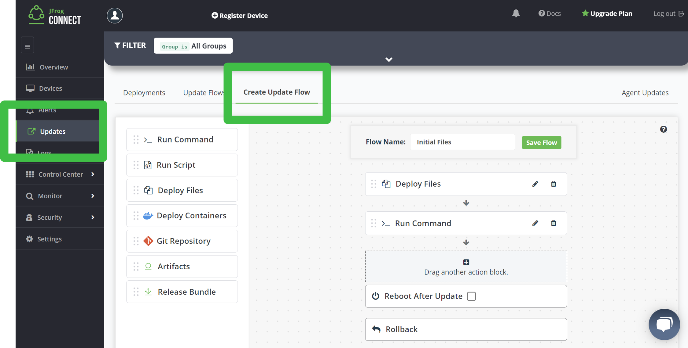
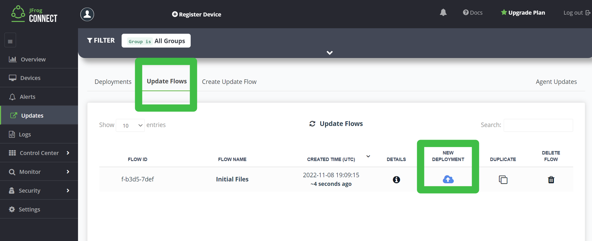
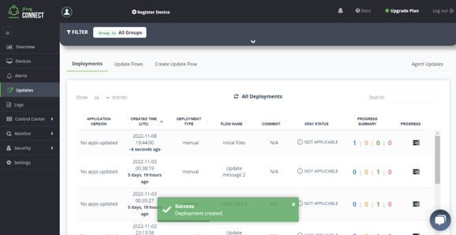

# Push Files to a Device, Compile, and Run #

## Before You Begin ##

### About This Lab ###
You'll create an update flow that pushes out the initial files and compiles the necessary binaries on your device. It's recommended that you get binaries you need working on one device before rolling out updates to the entire fleet. Because this is a TTY program, you'll need to start it manually on you device. Other types of programs may start automatically, like those meant for a kiosk.

### About JFrog Connect ###
JFrog Connect is a modern Linux-first IoT platform designed to efficiently monitor, manage and update edge and IoT devices at scale. This is performed over a network connection, also known as over the air (OTA).
Use-cases include manufacturing, automotive, security cameras, kiosks, and robots.

### Requirments ###
- Have in instance of JFrog Connect.
- Have a Raspberry Pi (RPi) or virtual device registered in Connect.
- *(optional)* You have git installed on your computer.

## Lab Instructions ##
### Create an Update Flow ###
1. Navigate to **Updates** > **Create Update Flow**.
2. Name the flow `Initial Files`.
3. Drag the **Deploy Files** block into the flow and click the **pencil icon** to edit the block.
	- **Destination**: `/home/pi`
	- Specify the 3 files for this sample project. They are available for download from git.
    ````bash
    git clone https://github.com/NickR2600/ConnectDemo01.git
    ````
4. Drag in the **Run Command** block and edit by adding this command:
    ````
    runuser -l pi -c 'make && ls' > /dev/tty1
    ````
5. Click **Save Flow**.
6. When asked about the General Rollback, select **Continue Anyway**
    

### Deploy the Update Flow ###
7. Navigate to **Updates** > **Update Flows**. 
8. Click the **New Deployment cloud icon** for the `Initial Files` update.
    
9. Click the **Select Devices** button.
	- Filter for, and select your specific device.
	- Select **Apply**, **Next**, **Finish**.
10. In this case, unselect **Set app version**.
11. Click **Create Deployment** and run the deployment.
    

### Observe the Update ###
12. Navigate to **Updates** > **Deployments**. 
13. For the update you just created, click the **progress** icon.
    
14. Observe the progress in the dialog box and the monitor attached to your RPi.
    
15. After the deployment succeeds, enter `./demo` on the keyboard connected to the RPi to run the program.
	- If you don’t have a RPi, do this in a 	remote terminal for the device created by Connect. **Remember to do this as the `pi` user**!

## Next Lab ##
Move on to the next lab, **Update a Device While its Program Runs**.