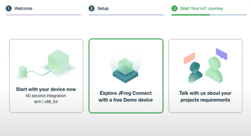

# Readying a Demo Device #

## Before You Begin ##

### About This Lab ###
If you don't have a Raspberry Pi (RPi) or other linux device, JFrog Connect can create a virtual device for you. The device is generated with the Connect agent already installed. Just like a real device, you'll be able to push out updates, see location and health statistics, and gain remote access.

**Note:** You can only create a demo device once. This chance occurs when you first login to your new Connect account. The demo device will expire after ~8 hours.

### About JFrog Connect ###
JFrog Connect is a modern Linux-first IoT platform designed to efficiently monitor, manage and update edge and IoT devices at scale. This is performed over a network connection, also known as over the air (OTA).
Use-cases include manufacturing, automotive, security cameras, kiosks, and robots.

### Requirements ###
- Have an email address that's not associated with an existing JFrog Connect free-tier instance.

## Lab Instructions ##

### Create a Demo Device ###
1. Navigate to the Connect webpage and choose **Start for Free**: https://jfrog.com/connect/
2. Select **Explore JFrog Connect with a free Demo Device** 
    
3. Name your project.

The device should be ready in about one minute. Try refreshing your browser if it doesn’t automatically show in the **Devices** list.

### Create the User `pi` ###
It's possible to work with Connect with only the root user, but creating a user `pi` helps consolidate later lab instructions.

4. Click the button for remote control access to the device. Within a few seconds, a reverse SSH tunnel is created. You will do this as the user `root`. Click **Connect**.
    
5. Create the user `pi` and give it a password:
    ````
    - useradd –m pi
	- passwd pi
    ````
6. Switch to the user `pi`.
    ````
    su - pi
    ````
7. Ensure that `gcc` and `make` are insalled:
    ````
    sudo apt-get install build-essential
    ````    

## Next Lab ##
Jump to Step 14 of the lab [Readying a Raspberry Pi](/Ready-RPi.md).